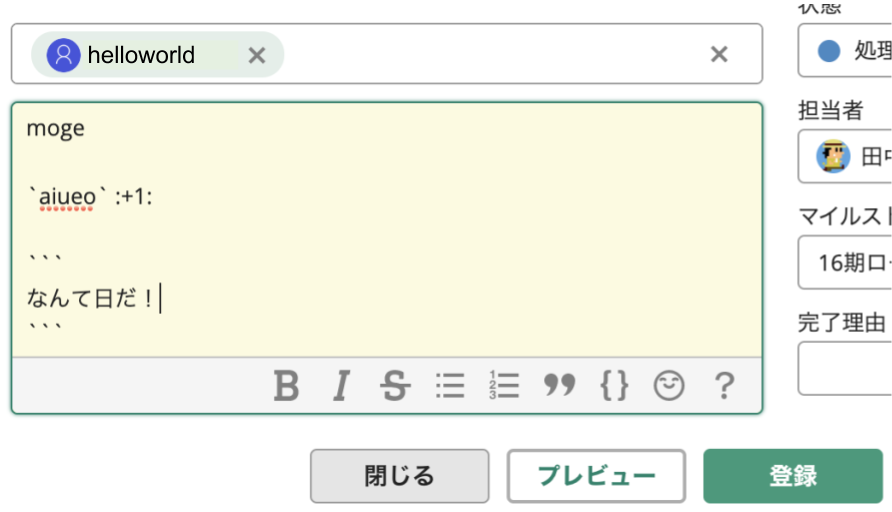
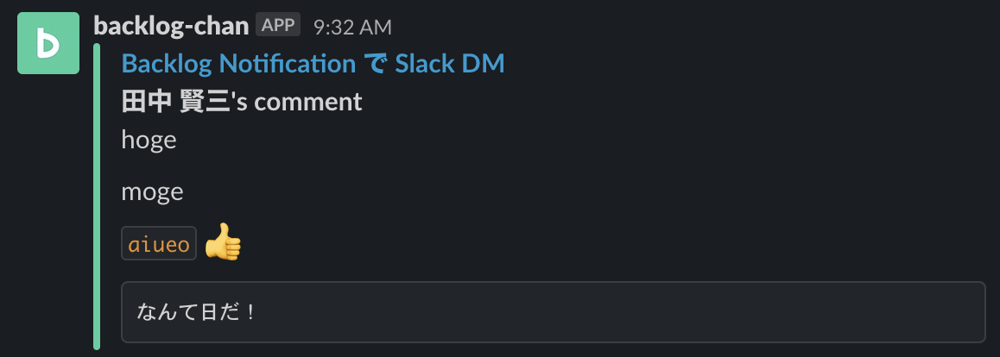

This SAM Project provides that builds API Gateway + Lambda that notifies Slack DM to the "user you want to notify" specified when adding a comment in a Backlog ticket.





## Preparation

### Install AWS SAM cli

Refer to [Installing the AWS SAM CLI](https://docs.aws.amazon.com/serverless-application-model/latest/developerguide/serverless-sam-cli-install.html)

### Install direnv

```shell
$ brew install direnv
```

### set AWS Credentilas

Set credentials that have Lambda deployment permission to the AWS Account of the deployment destination.

```shell
$ cp .envrc.sample .envrc

// set AWS_ACCESS_KEY_ID, AWS_SECRET_ACCESS_KEY

$ direnv allow .
```

### Create Slack app

Create a Slack app and grant the following permissions to the Bot Token Scope:

* chat:write : send message
* users:read : get user information
* users:read.email : get user information by email

When you create a Slack app and install the app in your workspace, a `Bot User OAuth Access Token` is generated.

Register the `Bot User OAuth Access Token` in the SSM parameter store with the key name "slack_bot_user_oauth_access_token".

### Generate Backlog API Key

Generate an API Key with reference to [Backlog ヘルプセンター - APIの設定](https://support-ja.backlog.com/hc/ja/articles/360035641754-API%E3%81%AE%E8%A8%AD%E5%AE%9A)

Register the API Key in the SSM parameter store with the key name "backlog_api_key".

### Encrypt user: password for Backlog Webhook Basic authentication

Set an arbitrary character string.

```shell
echo -n "<user>:<password>" | base64
```

Register the encrypted code in the SSM parameter store with the key name "backlog_basic_auth_enc".

## set VPC Config

Replace the below with your `SecurityGroupIds`, `SubnetIds`, `BACKLOG_BASE_URL`.

* The security group must be allow https from 0.0.0.0/0.
* Specify subnets where NatGateway is routed if you execute Lambda Function in private subnet.
  To call Backlog API, you must set to allow ip from Lambda Function.

```yml
  BacklogToSlackDM:
    Type: AWS::Serverless::Function
    Properties:
      ...
      VpcConfig:
        SecurityGroupIds: # allow https from 0.0.0.0/0
          - sg-replaceme  # Replace your security group
        SubnetIds:  # Use Private Subnet below where NatGateway is routed.
          - subnet-replaceme01  # Replace your private subnet
          - subnet-replaceme02  # Replace your private subnet
          - subnet-replaceme03  # Replace your private subnet
      ...
      Environment:
        Variables:
          BACKLOG_BASE_URL: 'https://example.backlog.com' # Replace your backlog base url
```

### If you change the key name

If you change the key name, change the following part of template.yml.

```yml
  BacklogToSlackDM:
    Type: AWS::Serverless::Function
    Properties:
      ...
      Environment:
        Variables:
          BACKLOG_API_KEY_NAME: 'backlog_api_key'
          SLACK_BOT_USER_OAUTH_ACCESS_TOKEN_NAME: 'slack_bot_user_oauth_access_token'
...
  Authorizer:
    Type: AWS::Serverless::Function
    Properties:
      Environment:
        Variables:
          BACKLOG_BASIC_AUTH_ENC_NAME: 'backlog_basic_auth_enc'
```

## Initial Deploy

```
sam deploy --guided
```

The file "samconfig.toml" is generated.

After that, you can deploy only with the following command.

```shell
make deploy
```

You manage your samconfig.toml in your git repository.

## set Backlog Webhook URL

After deployment, embed `<user>: <password>` for Basic authentication in the generated endpoint, and add Backlog > Project > Integration > Webhook.

ex: `https://<user>:<password>@<api-id>.execute-api.ap-northeast-1.amazonaws.com/Prod/webhook`
